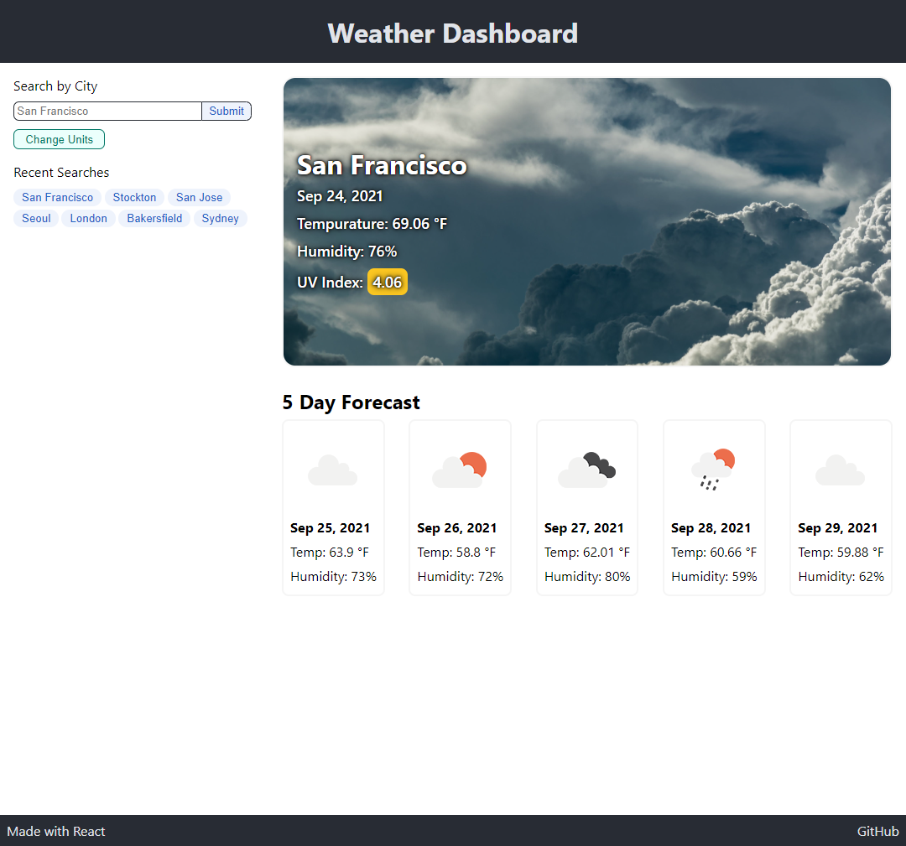

# Getting Started with Create React App

## Description

This is a simple Weather Dashboard with a 5-Day forecast that can be visited [HERE](https://markkhoo.github.io/50-Weather-Dashboard-REACT/). It is a spiritual successor to my [previous project](https://github.com/markkhoo/06-Weather-Dashboard). This project was bootstrapped with [Create React App](https://github.com/facebook/create-react-app). Weather data is fetched from [OpenWeatherMap](https://openweathermap.org/).

## How to Use
To search for weather, input a `city` in the form (specifiying city by state and country is currently not available). Recent cities searched by you are displayed underneath the form. You can switch from `Imperial` to `Metric` units using the `Change Units` button.

